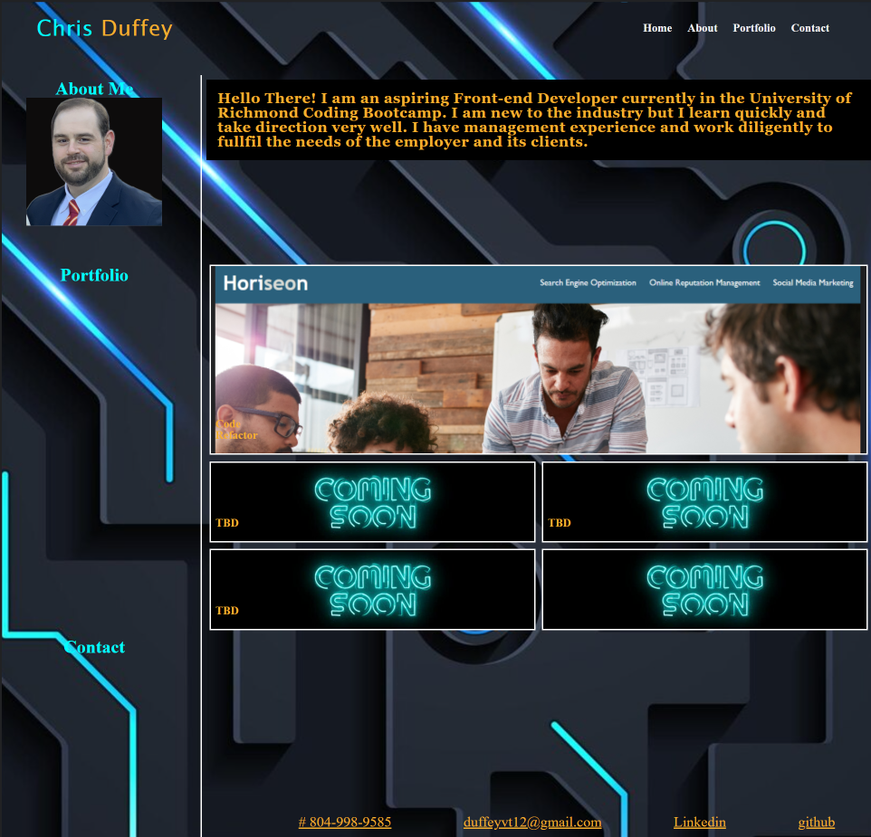

# portfolio-
Challenge 2 Advanced CSS
## Portfolio Challenge

Description: What we leared
-How to build a portfolio site from scratch using HTML and CSS
-The relationship between HTML and CSS and how they interact to give a site structure and style.
-How to showcase our work to future employers, clients, etc..

## User Story
* As a potential job canadiate 
* I want a site to showcase my work
* SO THAT employeers sheet my level of skill 

## Acceptance Criteria 
*GIVEN When I interview for job roles
*WHEN I want to show my projects
*THEN I can present my portfolio site
*WHEN I do more projects 
*THEN I will have a place to showcase them
*When someone views my portfolio from a smaller device
*Then my site will adjust to the viewer's screen ledgibly.

## Usage
<!-- link to git hub pages -->
Github page 
(https://chrisduffey.github.io/portfolio/)

Repository URL
(https://github.com/chrisduffey/portfolio/)

Page URL
(http://127.0.0.1:5500/repos/portfolio-/index.html)

## Mock-Up
Mock up display
()

